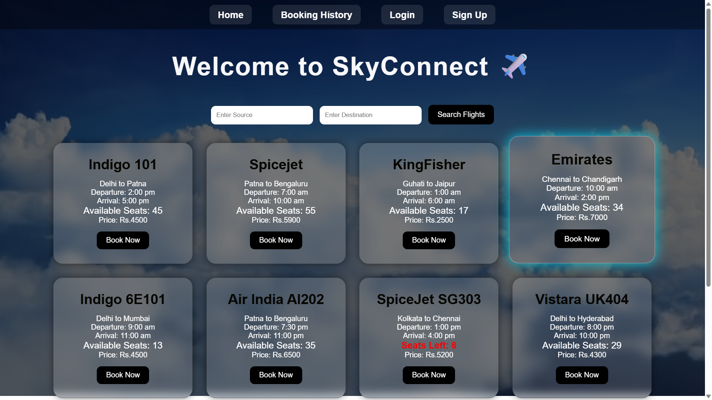
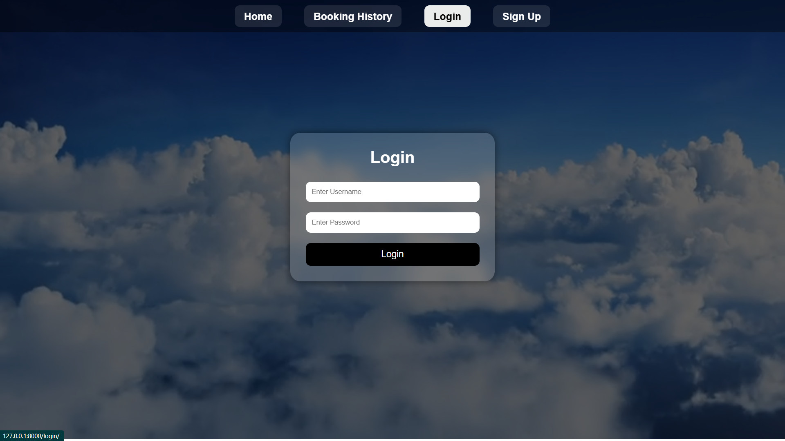
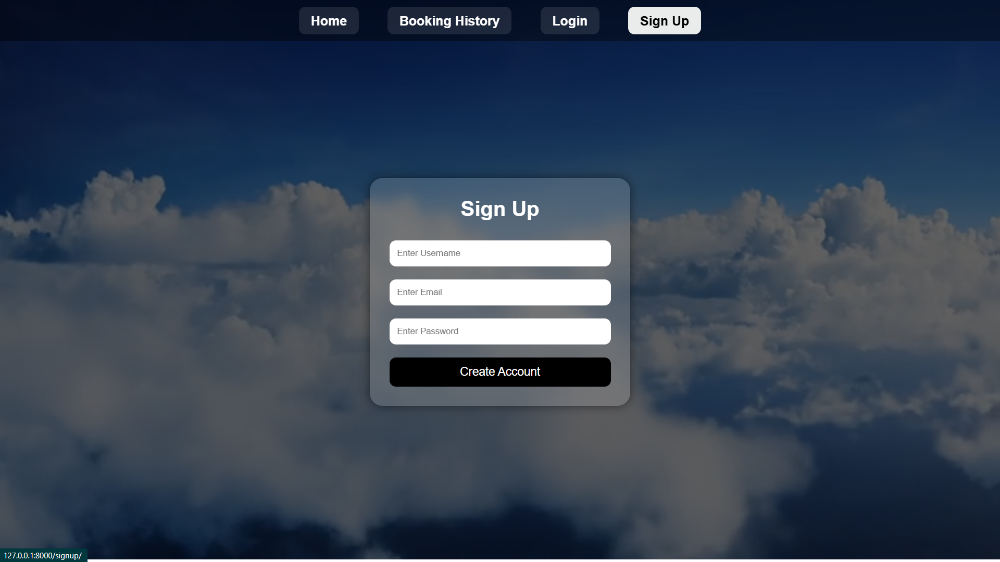
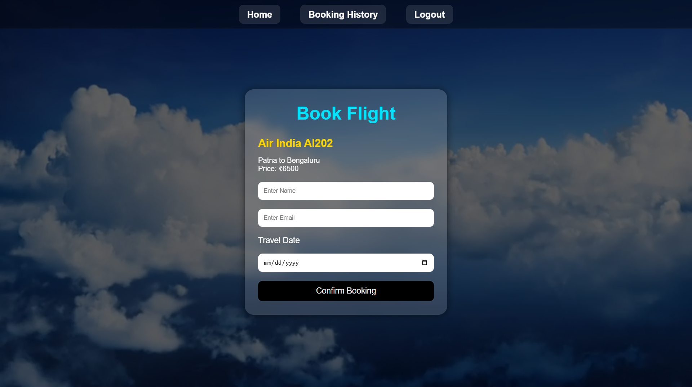
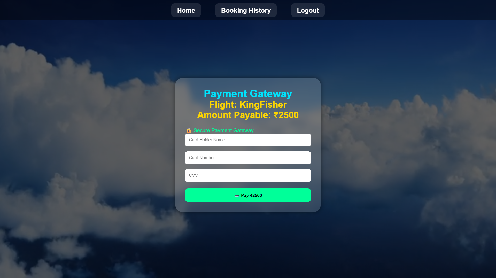
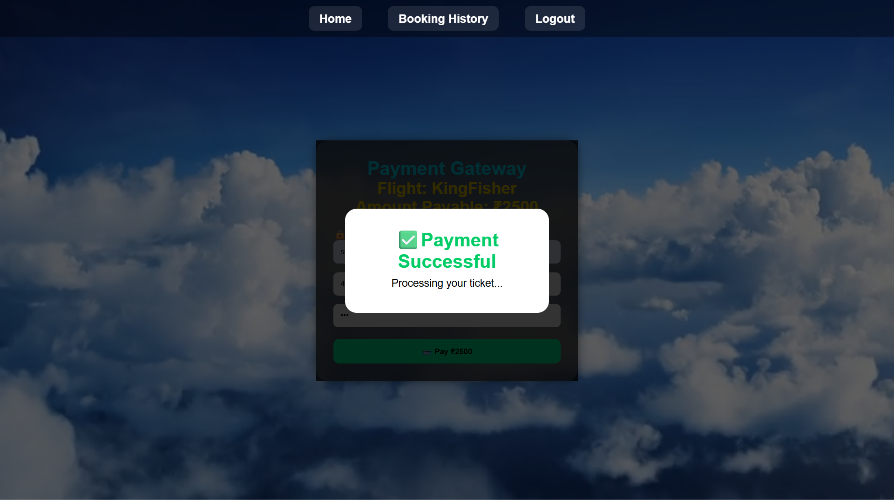
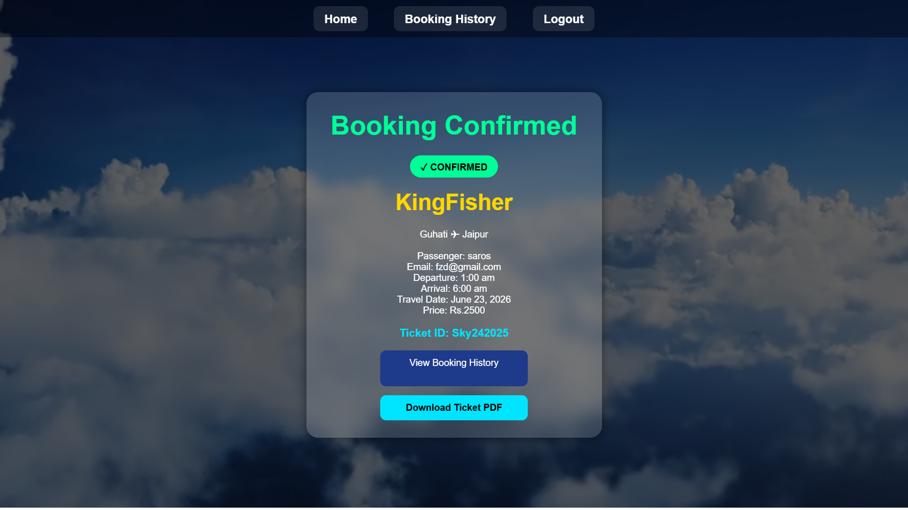
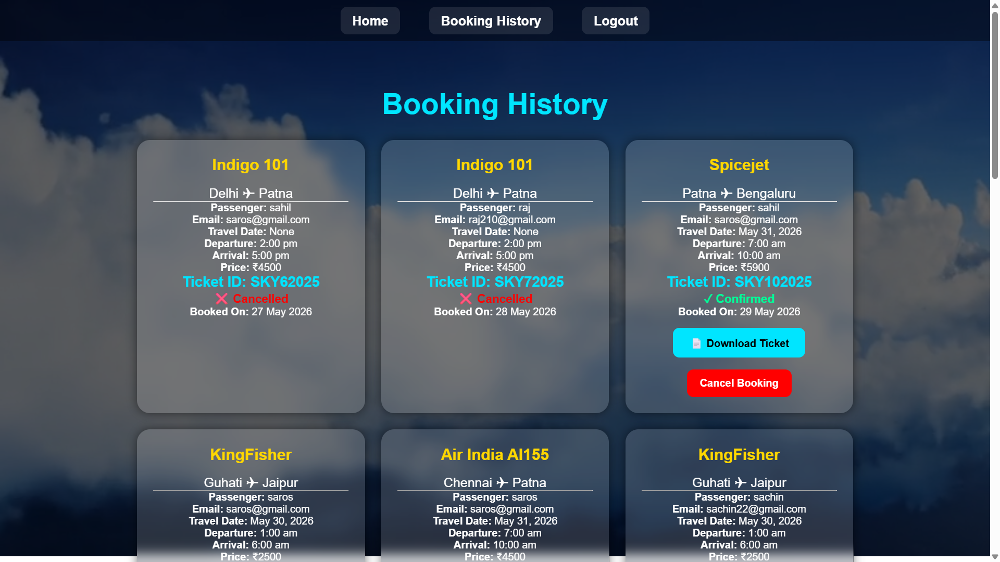
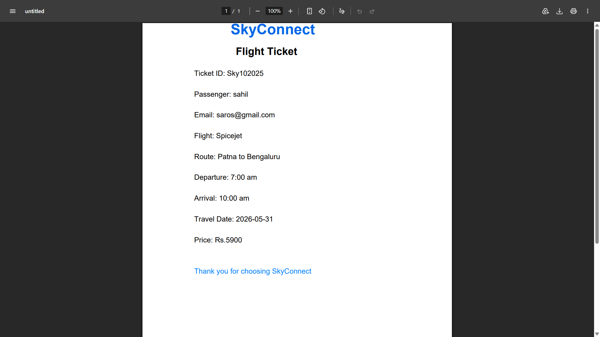

# ✈️ SkyConnect Flight Management System
A web-based Flight Management System developed using Django that allows users to search flights, book tickets, make simulated payments, download PDF tickets, view booking history, and cancel bookings with automatic seat restoration.

---

## 🚀 Features

### 👤 User Authentication
* User Registration (Sign Up)
* User Login
* User Logout

### ✈️ Flight Management
* View available flights
* Search flights by source and destination
* Display departure and arrival times
* Show seat availability

### 🎫 Booking System
* Book flights with passenger details
* Select travel date
* Booking confirmation page
* Unique Ticket ID generation

### 💳 Payment Gateway Simulation
* Simulated payment page
* Payment success animation
* Multi-step booking workflow

### 📄 Ticket Generation
* Download PDF ticket after booking
* Download ticket from booking history
* Professional ticket format with SkyConnect branding

### 📚 Booking History
* View all previous bookings
* Download tickets anytime
* View booking status

### ❌ Booking Cancellation
* Cancel booked flights
* Automatic seat refund system
* Booking status changes from Confirmed to Cancelled

---

## 🛠️ Tech Stack

### Backend
* Python
* Django

### Frontend
* HTML
* CSS

### Database
* SQLite

### Additional Libraries
* ReportLab (PDF Generation)

---

## 📸 Screenshots

### Home Page


### Login Page


### SignUp Page


### Book FLight Page


### Payment Gateway


### Payment Successful Page


### Booking Confirmation


### Booking History


### PDF Ticket


---

## ⚙️ Installation

### Clone Repository

```bash
git clone https://github.com/mrsaurav020-coder/flight_management-system
```

### Navigate to Project Folder

```bash
cd flight_management-system
```

### Install Dependencies

```bash
pip install -r requirements.txt
```

### Run Migrations

```bash
python manage.py makemigrations
python manage.py migrate
```

### Start Development Server

```bash
python manage.py runserver
```

### Open Browser
http://127.0.0.1:8000/

---

## 🎯 Future Enhancements
* Real Payment Gateway Integration
* Flight Class Selection (Economy, Business)
* Email Ticket Delivery
* Flight Cancellation Reasons
* Admin Analytics Dashboard
* Mobile Responsive Design

---

## 👨‍💻 Developer
**Saurav Suman**
GitHub: https://github.com/mrsaurav020-coder
LinkedIn: https://www.linkedin.com/in/saurav-suman-dev/

---

## ⭐ Project Status
Completed and actively maintained for learning and portfolio development.
